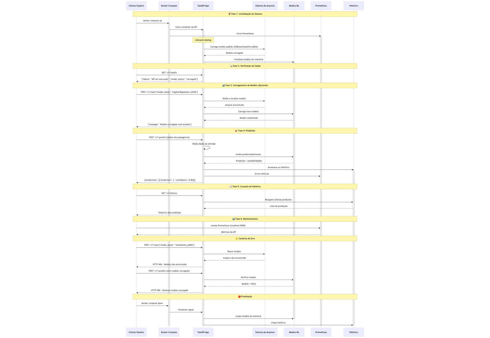

### Para execução desse projeto, siga os seguintes passos

## Passo 1

Use a versão python 3.12 

Crie a venv  
`python3 -m venv venv`

Ative a venv

No Linux ou Mac:

`source venv/bin/active`

No Windows:

`venv/Scripts/activate`

Se estiver usando Linux, instale os requerimentos abaixo

`pip install -r requirements.txt`

Caso esteja utilizando macos, instale esses requerimentos

`pip install -r requirements_macos.txt`


## Passo 2

Execute o `model_development.ipynb` com venv criada com Python 3.12

Após executá-lo, a pasta saved_models irá ser criada e com os seguintes arquivos

1. `LogisticRegression.joblib`

2. `RadomForestClassifier.joblib`

3. `XGBoostClassifier.joblib`

Eles serão os modelos possiveis para carregamento no endpoint `v1/load`

## Passo 3

Suba a aplicação com o comando

`docker compose up`

A aplicação estará disponivel no `localhost:8000` e a documentação no `localhost:8000/docs`

Os endpoints dela são

1. `localhost:8000/v1/health` (Checa status da API)

2. `localhost:8000/v1/history`(Retorna historico de predições)

3. `localhost:8000/v1/load` (Carrega um modelo)

4. `localhost:8000/v1/predict` (Realiza predições)
  
Exemplo de json a ser usado no corpo do request por endpoint

1. `v1/load`
  
  
  ```json
     {
	"model_name": "XGBoostClassifier.joblib"
     }
  ```
 
2. `v1/predict`
```json
   {
  "passengers": [
    {
      "Pclass": 2,
      "Sex": "female",
      "Age": 3,
      "SibSp": 3,
      "Parch": 1,
      "Fare": 71.2833,
      "Embarked": "C"
    },
    {
      "Pclass": 3,
      "Sex": "female",
      "Age": 3,
      "SibSp": 0,
      "Parch": 10,
      "Fare": 8.05,
      "Embarked": "S"
    },
    {
      "Pclass": 1,
      "Sex": "male",
      "Age": 40,
      "SibSp": 1,
      "Parch": 1,
      "Fare": 340.0,
      "Embarked": "S"
    }
  ]
}
```

Exemplo de retorno para cada endpoint

1. `v1/health`

```json
   {
	"status": "API está em execução",
	"model_status": "carregado: Pipeline"
   }
```
2. `v1/history`


```json
   [
	{
		"request": {
			"passengers": [
				{
					"PassengerId": null,
					"Name": null,
					"Pclass": 2,
					"Sex": "female",
					"Age": 3.0,
					"SibSp": 3,
					"Parch": 1,
					"Ticket": null,
					"Fare": 71.2833,
					"Cabin": null,
					"Embarked": "C"
				},
				{
					"PassengerId": null,
					"Name": null,
					"Pclass": 3,
					"Sex": "female",
					"Age": 3.0,
					"SibSp": 0,
					"Parch": 10,
					"Ticket": null,
					"Fare": 8.05,
					"Cabin": null,
					"Embarked": "S"
				},
				{
					"PassengerId": null,
					"Name": null,
					"Pclass": 1,
					"Sex": "male",
					"Age": 40.0,
					"SibSp": 1,
					"Parch": 1,
					"Ticket": null,
					"Fare": 340.0,
					"Cabin": null,
					"Embarked": "S"
				}
			]
		},
		"response": {
			"predictions": [
				{
					"prediction": 1,
					"confidence": 0.9794692993164062
				},
				{
					"prediction": 1,
					"confidence": 0.5370106101036072
				},
				{
					"prediction": 1,
					"confidence": 0.5345702171325684
				}
			]
		}
	}
]
```

3. `v1/load`
```json
   {
	"message": "Modelo 'LogisticRegression.joblib' carregado com 
    sucesso."
   }
```

4. `v1/predict`

```json
   {
	"predictions": [
		{
			"prediction": 1,
			"confidence": 0.7512123357970764
		},
		{
			"prediction": 0,
			"confidence": 0.7454974786782412
		},
		{
			"prediction": 1,
			"confidence": 0.6142194713911896
		}
	]
}
```


O prometheus está disponivel no `localhost:9090`

Grafana está disponivel no `localhost:3000`

## Diagrama do Processo




